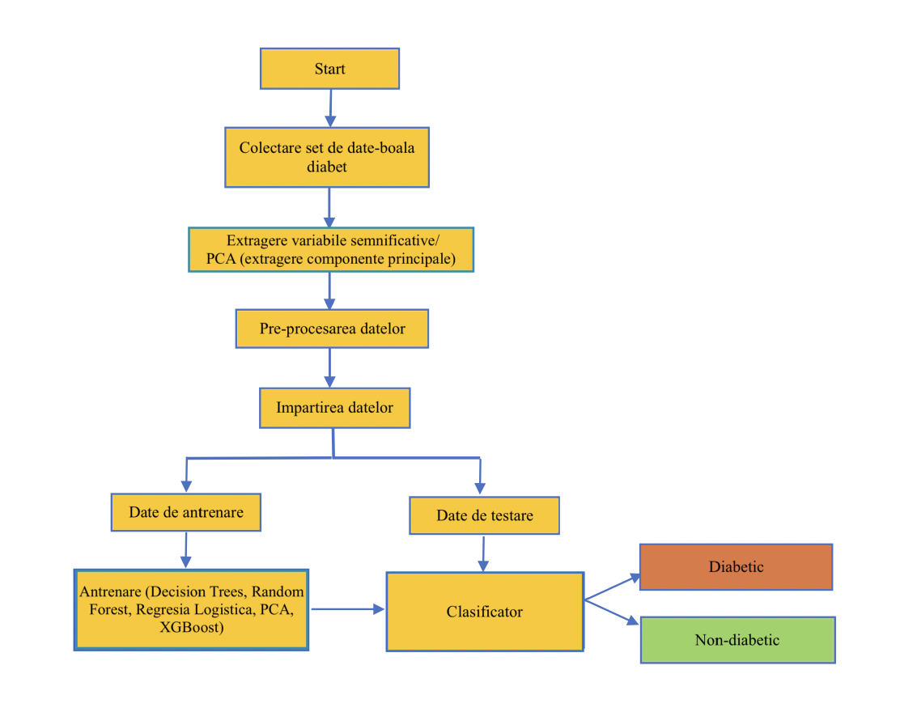
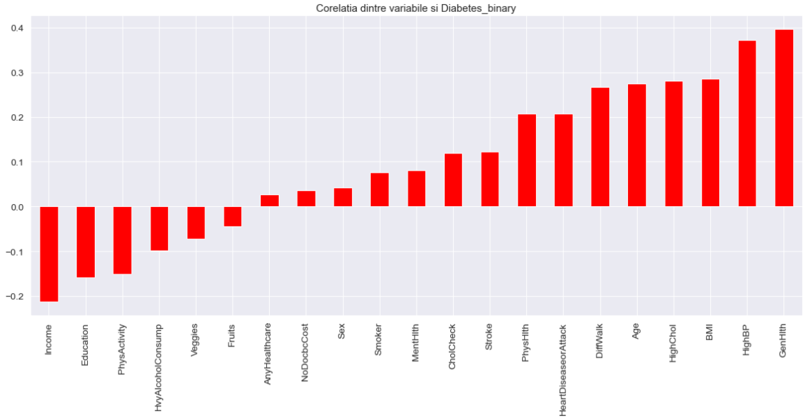
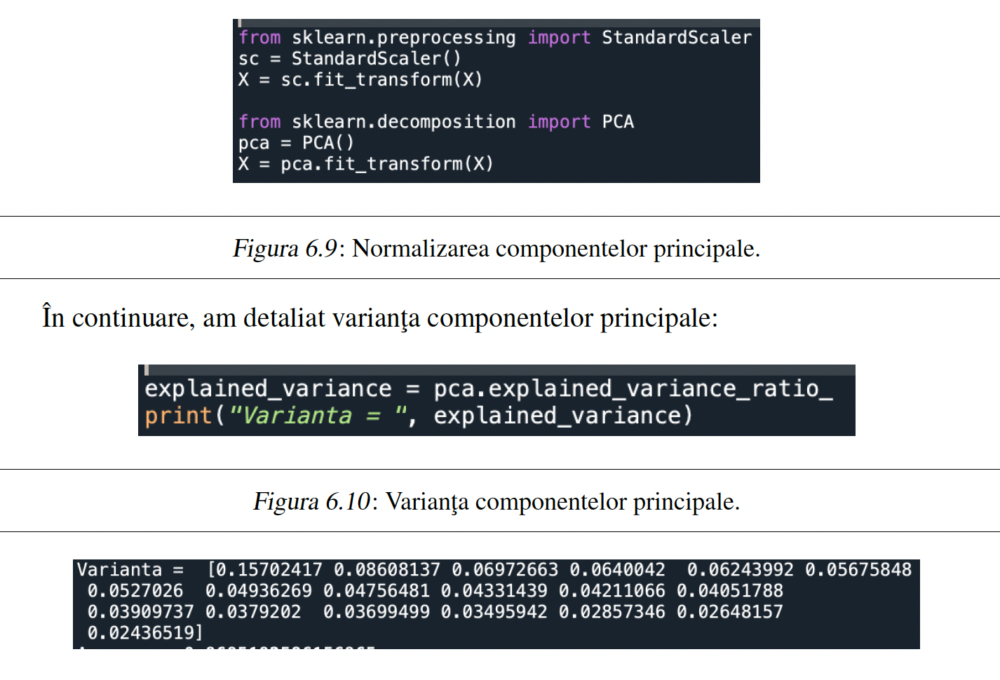
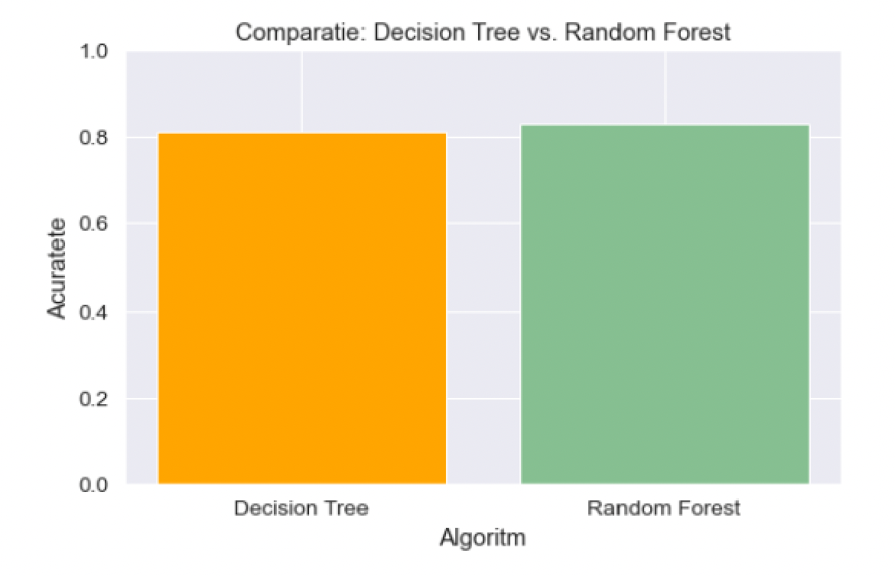

# 🩺 Diabetes Prediction using Machine Learning

Machine Learning project developed as part of my Bachelor's Thesis.

The project predicts whether a patient is likely to have diabetes based on medical and lifestyle characteristics using several supervised learning algorithms.

---

## 📌 Project Overview

This project explores the application of Machine Learning techniques for diabetes prediction using healthcare data.

Different classification algorithms were trained and evaluated to determine the most accurate model.

The workflow includes:

- Data preprocessing
- Exploratory Data Analysis (EDA)
- Correlation analysis
- Principal Component Analysis (PCA)
- Model training
- Performance evaluation

---

## 📊 Dataset

**Dataset:** Behavioral Risk Factor Surveillance System (BRFSS)

Features include:

- Blood Pressure
- Cholesterol
- BMI
- Smoking
- Physical Activity
- Fruits & Vegetables Consumption
- General Health
- Mental Health
- Physical Health
- Age
- Sex
- Education
- Income

Dataset characteristics:

- **70,692 instances**
- **22 features**
- Binary classification problem

---

## 🤖 Machine Learning Models

The following models were implemented and compared:

- 🌲 Random Forest
- 🌳 Decision Tree
- 📈 Logistic Regression
- 📉 Principal Component Analysis (PCA)

---

## 📈 Results

| Model | Accuracy |
|--------|----------|
| 🌲 Random Forest + PCA | **87%** |
| 🌳 Decision Tree + PCA | **85%** |
| 📈 Logistic Regression | Evaluated |

Random Forest combined with PCA achieved the best overall performance.

---

## 🛠 Technologies

- Python
- Pandas
- NumPy
- Scikit-learn
- Matplotlib
- Seaborn
- Jupyter Notebook

---

## 📷 Project Screenshots

### Application Workflow

---

### Correlation Analysis

---

### Principal Component Analysis

---

### Random Forest Results

---

### Confusion Matrix

---

### Model Comparison

---

## 🎓 Academic Context

This project was developed as part of my Bachelor's Thesis in Computer Science at **Ovidius University of Constanța**.

The study investigates Machine Learning techniques for early diabetes prediction using demographic, medical and lifestyle information. :contentReference[oaicite:1]{index=1}

---

## 📬 Contact

**Georgiana Petre**

GitHub:
https://github.com/PetreGeorgiana

LinkedIn:
www.linkedin.com/in/petre-georgiana-320ba3290
