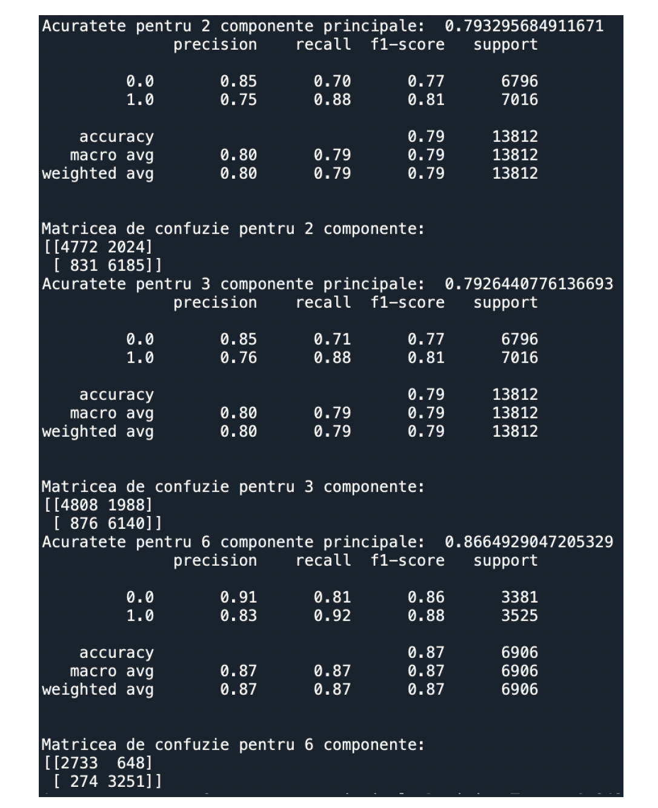

# 🩺 Diabetes Prediction using Machine Learning

Machine Learning project developed as part of my Bachelor's Thesis.

This project predicts whether a patient is likely to develop diabetes based on medical and lifestyle indicators using multiple Machine Learning algorithms. The application includes data preprocessing, exploratory data analysis, dimensionality reduction with PCA, model training, evaluation and performance comparison.

---

# 🚀 Features

- 📊 Exploratory Data Analysis (EDA)
- 🧹 Data preprocessing
- 📈 Statistical analysis
- 🔥 Correlation analysis
- 📉 Histograms and data visualization
- 🧠 Principal Component Analysis (PCA)
- 🌳 Decision Tree Classifier
- 🌲 Random Forest Classifier
- 📐 Logistic Regression
- ⚡ XGBoost Classifier
- 🤝 Voting Classifier Ensemble
- 📋 Confusion Matrix
- 📊 Classification Report
- 🎯 Model accuracy comparison

---

# 🛠 Technologies

- Python
- Pandas
- NumPy
- Matplotlib
- Seaborn
- Scikit-learn
- SciPy
- XGBoost

---


# 📊 Dataset

The project uses the **CSI Diabetes Dataset**.

Dataset characteristics:

- 👥 70,692 patient records
- 📑 22 medical and lifestyle features
- 🎯 Binary classification (Diabetes / No Diabetes)

The dataset is not included in this repository due to its size.

---

# 🤖 Machine Learning Models

The following algorithms were implemented and evaluated:

- Logistic Regression
- Decision Tree
- Random Forest
- XGBoost
- Voting Classifier

Principal Component Analysis (PCA) was applied before model training to reduce dimensionality and improve visualization.

---

# 📈 Evaluation Metrics

Models were evaluated using:

- Accuracy
- Precision
- Recall
- F1-score
- Confusion Matrix
- Classification Report

---

# 📷 Screenshots

## 🔹 Correlation Matrix


---

## 🔹 PCA Visualization


---

## 🔹 Confusion Matrix



---

## 🔹 Dataset Analysis


---

# 📄 Documentation

Bachelor's Thesis

📘 Available in:

```
docs/Bachelor_Thesis.pdf
```

---

# ▶️ Running the Project

Clone the repository:

```bash
git clone https://github.com/PetreGeorgiana/Diabetes-Prediction-ML.git
```

Install dependencies:

```bash
pip install -r requirements.txt
```

Run:

```bash
python src/DiabetPrediction.py
```

---

# 📬 Author

**Georgiana Petre**

💼 LinkedIn:
www.linkedin.com/in/petre-georgiana-320ba3290

💻 GitHub:
https://github.com/PetreGeorgiana
